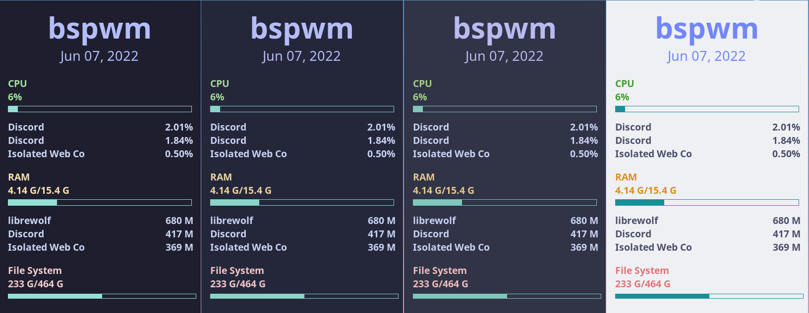

<h3 align="center">
	 
	
	Catppuccin for Conky
	
</h3>

    
    
    

	

## Usage

1. Choose your flavour.
2. Copy *flavour*.conf to `$HOME/.config/conky/flavour.conf`
3. Run using `conky -c $HOME/.config/conky/flavour.conf`

## 💝 Thanks to

-   [Lexi](https://github.com/ShyyLexi)
-	[Spaxly](https://github.com/Spaxly)

&nbsp;

Copyright &copy; 2020-present <a href="https://github.com/catppuccin" target="_blank">Catppuccin Org</a>

